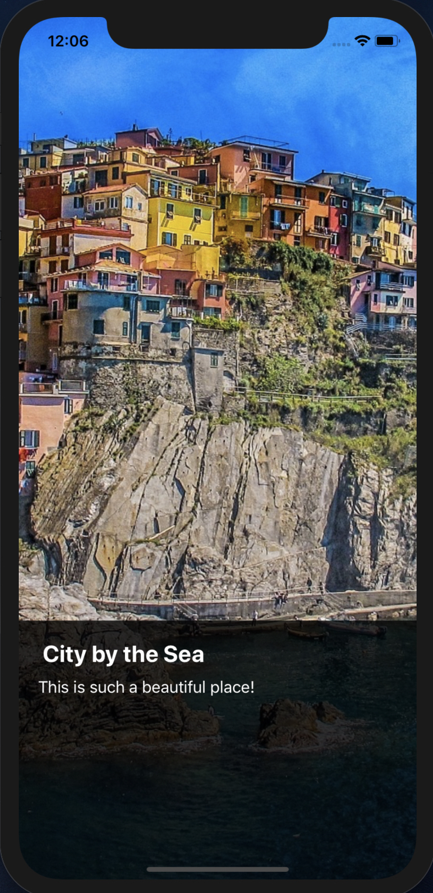

<h1>About this repository</h1>

I am learning about auto layout in order to size and position elements on the user interface no matter the size of iPhone nor the orientation. The constraints for each element are dynamic, meaning the constraints are relative to other elements. This enables for proper display of images, labels, and views.

 
